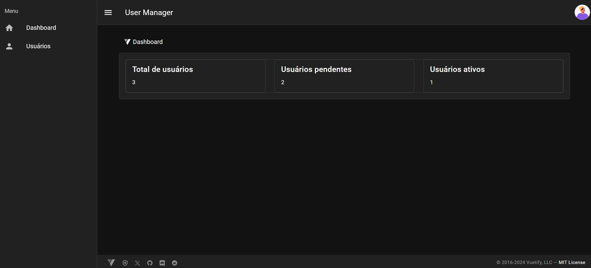
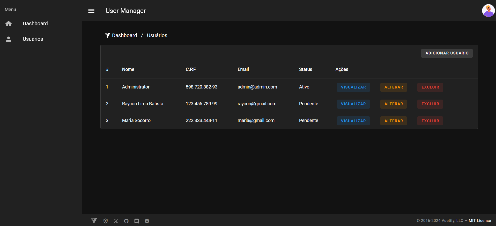

# Plataforma de Gestão de Usuários: Laravel & Vue 3

## Descrição Geral
Este projeto é um sistema de gerenciamento de usuários construído com Laravel 11 para o backend e Vue 3 para o frontend. Ele oferece funcionalidades como cadastro, login, atualização de perfil e gerenciamento de permissões de usuários.

## Screenshots
<p align="left">
  
  
  
  
</p>
<p align="left">
  
  
  
  
</p>

## Estrutura do Projeto
backend: Contém toda a lógica do servidor, incluindo rotas, controladores, modelos e banco de dados.
frontend: Responsável pela interface do usuário, construída com componentes Vue 3 e consumindo a API REST do backend.

## Funcionalidades
- Cadastro de usuários realizada por membros do sistema.
- Cadastro externo de usuários: Permite que usuários externos se registrem no sistema.
- Login: Autenticação de usuários para acessar áreas restritas.
- Perfil de usuário: Visualização e edição de informações pessoais.
- Recuperação de senha: Permite que usuários recuperem suas senhas perdidas.

## Tecnologias Utilizadas
- Backend: Laravel 11, PHP, PostgreSQL, Docker
- Frontend: Vue 3, Vue Router, Pinia, Axios, Maska, Vee-Validate, Yup, Vuetify, Vite, Tailwind CSS

## Guia Rápido
1. Pré-requisitos:
    - PHP com as extensões necessárias para o Laravel
    - Node.js e npm (ou yarn) para o frontend
    - Um banco de dados (PostgreSQL)
2. Clone o repositório:
```bash
    git clone https://github.com/RayconLima/user-crudify.git
```

3. Instale as dependências:
```bash
# Backend
cd backend
composer install

# Frontend
cd frontend
yarn add (ou npm install)
```

4. Seguir as instruções no arquivo README.md do backend para configurar o ambiente e executar o projeto.
- [Backend](backend/README.md)
- [Frontend](frontend/README.md)